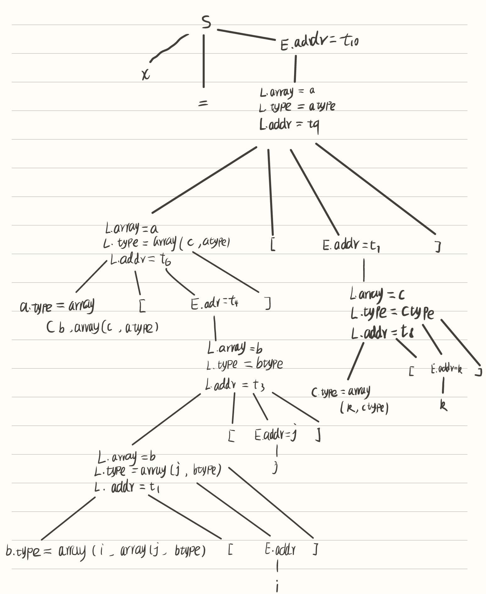

## 练习6.1.1 
**为下列表达式构建DAG并指出每个子表达式的值编码**

$$((x+y)-((x+y)*(x-y)))+((x+y)*(x-y))$$

首先建立值编码，绘制数组如下：
|序号|op|left|right|
|--|--|--|--|
|1|id|x||
|2|id|y||
|3|+|1|2|
|4|-|1|2|
|5|*|3|4|
|6|-|3|5|
|7|+|6|5|

DAG图如下：


## 练习6.1.2
**将语句a=-(b+c)翻译为**


1. AST为：


2. 四元式序列为：

三地址码为：

$t_1 = b - c$  
$t_2 = -t_1$  
$a = t_2$

则四元式序列为：
|序号|op|arg1|arg2|result|
|--|--|--|--|--|
|0|-|b|c|$t_1$
|1|minus|$t_1$||$t_2$|
|2|=|$t_2$||a|

3. 三元式表示：

|序号|op|arg1|arg2|
|--|--|--|--|
|0|-|b|c||
|1|minus|(0)|
|2|=|a|(1)|  

4.间接三元式表示为：

|序号|op|arg1|arg2|
|--|--|--|--|
|0|-|b|c||
|1|minus|(0)|
|2|=|a|(1)|  

|序号|op|
|--|--|
|0|(0)|
|1|(1)|
|2|(2)|


## 练习6.1.3
**确定下列声明序列中各个标识符的类型和相对地址，这里我们使用龙书6.3.2中提到的文法**

```C
float x;
record{float x;float y;} p;
record{
    record{int tag;float x;}m;
    float y;
} q;
```

|line|name|type|offset|env|
|--|--|--|--|--|
|1|x|float|0|1|
|2|x|float|0|2|
|2|y|float|8|2|
|2|p|record|8|1|
|4|tag|int|0|4|
|4|x|float|4|4|
|4|m|record()|0|3|
|5|y|float|12|3|
|6|q|record()|24|1|


## 练习6.1.4
**考虑龙书图6-22的翻译方案，翻译赋值语句 $x=a[b[i][j]][c[k]];$ 并给出注释语法分析树。**

其中，atype,btype,ctype分别表示a,b,c数组的类型，i,j,k表示数组的长度，
