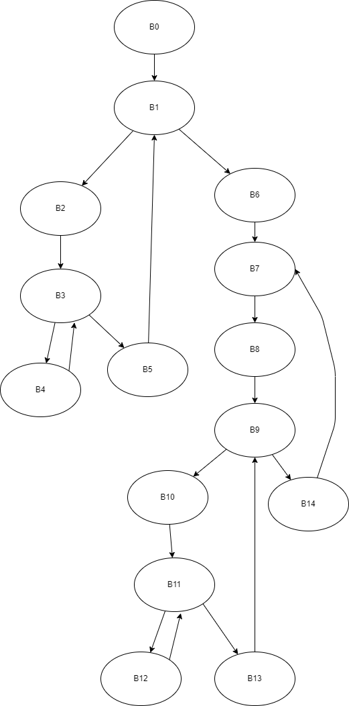
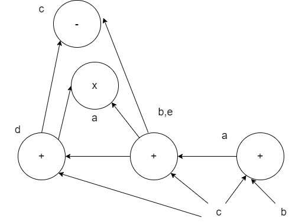

# 练习8.2.1 
**考虑下面的矩阵乘法程序：**
1. **假设每个矩阵元素占4字节，且矩阵按行存放，把程序翻译成本节中的三地址语句并标出基本块**  
2. **为1.中得到的代码构造流图**  
3. **找到2.中流图中的循环**  
```C
for(i=0;i<n;i++)
    for(j=0;j<n;j++)
        c[i][j] = 0.0;

for(i=0;i<n;i++)
    for(k=0;k<n;k++)
        for(j=0;j<n;j++)
            c[i][j] = c[i][j] + a[i][k] * b[k][j];
```

1.

        (1) i=0
        (2) if i>=n goto (13)
        (3) j=0
        (4) if j>=n goto (11)
        (5) t0=i*n
        (6) t1=t0+j
        (7) t2=t1*4
        (8) c[t2]=0.0
        (9) j=j+1
        (10) goto (4)
        (11) i=i+1
        (12) goto(2)
        (13) i=0
        (14) if i>=n goto (40)
        (15) k=0
        (16) if k>=n goto (38)
        (17) j=0
        (18) if j>=n goto (36)
        (19) t1 = i * n
        (20) t2 = k * n
        (21) t3 = t1 + j
        (22) t3 = t3 * 4   
        (23) t4 = t2 + j
        (24) t4 = t4 * 4   
        (25) t5 = a[t3]    
        (26) t6 = b[t4]    
        (27) t7 = t5 * t6
        (28) t8 = i * n
        (29) t9 = t8 + j
        (30) t9 = t9 * 4   
        (31) t10 = c[t9]   
        (32) t11 = t10 + t7
        (33) c[t9] = t11   
        (34) j = j + 1
        (35) goto (18)
        (36) k = k + 1
        (37) goto (16)
        (38) i = i + 1
        (39) goto (14)

由基本块的构造方法，可知第(1)(2)(3)(4)(5)(14)(15)(16)(17)(18)(19)首指令，然后(13)(11)(38)(36)也是首指令。故可以得到各个基本块：

        B0:
        (1) i=0

        B1:
        (2) if i>=n goto (13)

        B2:
        (3) j=0

        B3:
        (4) if j>=n goto (11)

        B4:
        (5) t0=i*n
        (6) t1=t0+j
        (7) t2=t1*4
        (8) c[t2]=0.0
        (9) j=j+1
        (10) goto (4)

        B5:
        (11) i=i+1
        (12) goto(2)

        B6:
        (13) i=0

        B7:
        (14) if i>=n goto (40)

        B8:
        (15) k=0

        B9:
        (16) if k>=n goto (38)

        B10:
        (17) j=0

        B11:
        (18) if j>=n goto (36)

        B12:
        (19) t1 = i * n
        (20) t2 = k * n
        (21) t3 = t1 + j
        (22) t3 = t3 * 4   
        (23) t4 = t2 + j
        (24) t4 = t4 * 4   
        (25) t5 = a[t3]    
        (26) t6 = b[t4]   
        (27) t7 = t5 * t6
        (28) t8 = i * n
        (29) t9 = t8 + j
        (30) t9 = t9 * 4   
        (31) t10 = c[t9]   
        (32) t11 = t10 + t7
        (33) c[t9] = t11   
        (34) j = j + 1
        (35) goto (18)

        B13:
        (36) k = k + 1
        (37) goto (16)

        B14:
        (38) i = i + 1
        (39) goto (14)

2.
由流图的构造方法，可构造得以下流图：


3.
由循环的判断条件可知，存在循环

        {B3, B4}
        {B1, B2, B3, B4, B5}
        {B1, B2, B3, B5}
        {B11, B12}
        {B9, B10, B11, B12, B13}
        {B9, B10, B11, B13}
        {B7, B8, B9, B14}
        {B7, B8, B9, B10, B11, B12, B13, B14}
        {B7, B8, B9, B10, B11, B13, B14}


# 练习8.2.2
**考虑右面的基本块**

1. **构造 DAG**
2. **假设只有 a 在基本块出口活跃，尝试优化右面的代码，并简述用到的技术**

```
a = b + c
b = a + c
d = b + c
e = a + c
c = b - d
a = e * d
```
1.  
DAG为：



2.
优化后的代码为：

        a=b+c
        b=a+c
        d=b+c
        a=b*d
**删除公共子表达式**和**删除死代码**