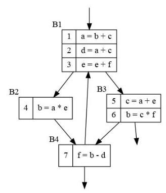

# 练习8.3.1：
**为下面流图中的程序计算：**  
1. ud链和du链
2. 每块末尾的活跃变量
3. 每块的控制节点和后控制节点
4. 寄存器冲突图
5. 如果要避免寄存器溢出，至少需要多少寄存器？为什么？

## 1
**ud链和du链**  
ud链：

        1: b:{4,6} c:{5}
        2: a:{1} c:{5}
        3: e:{3} f:{7}
        4: a:{1} e:{3}
        5: a:{1} e:{3}
        6: c:{5} f:{7}
        7: b:{4,6} d:{2}

du链：

       1. a:{2,4,5}
       2. b:{7}
       3. e:{3,4,5}
       4. b:{1,7}
       5. c:{1,2,6}
       6. b:{1,7}
       7. f:{3,6}

## 2

        B1:a,c,d,e,f
        B2:b,c,d,e
        B3:b,c,d,e
        B4:b,c,d,f

## 3
控制节点：

        B1:B1
        B2:B1,B2
        B3:B1,B3
        B4:B1,B4

后控制节点：

        B1:B1
        B2:B2,B4
        B3:B3
        B4:B4
## 4
寄存器冲突图，首先给出每条语句之后的活跃变量集：

    1:{a,c}
    2.{a,d}
    3:{a,e,f,d}
    4:{b,d}
    5:{d,f,c}
    6:{b,d}
    7:{b,f}

然后，根据活跃变量集，可以得到冲突图：  

## 5
利用k-coloring算法，可以得到最少的颜色数为5，所以至少需要5个寄存器，可以避免溢出。  
若k小于等于5，则无法找到一个着色方案。当k为5时，压栈的顺序为：
||
|-|
|f|
|d|
|a|
|e|
|c|
|b|