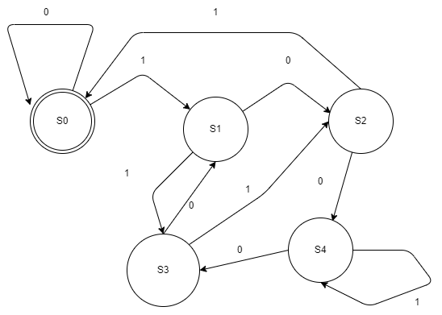
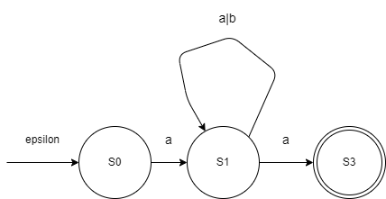
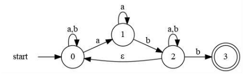
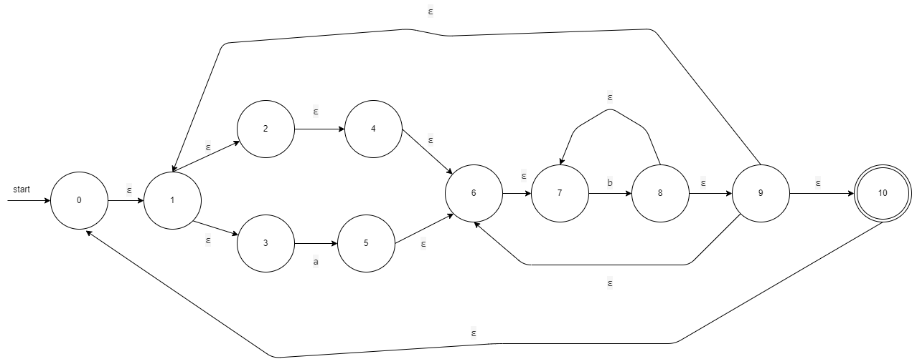
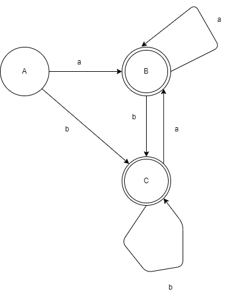
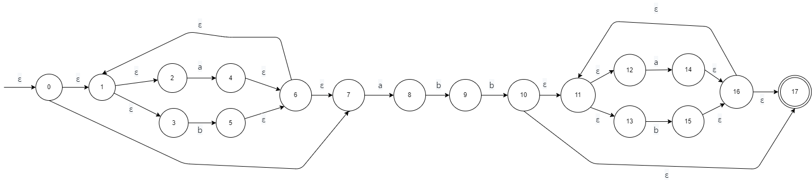
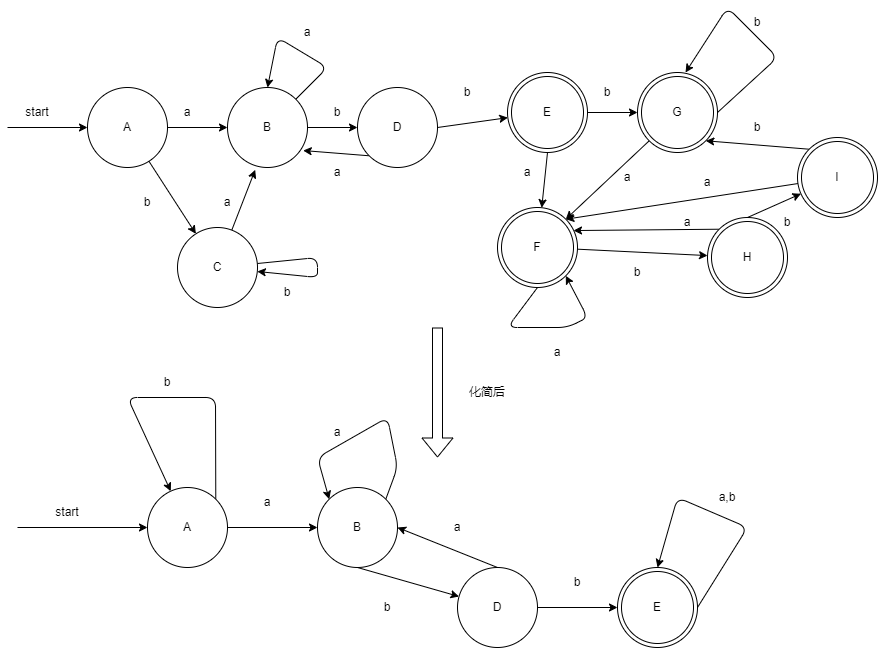
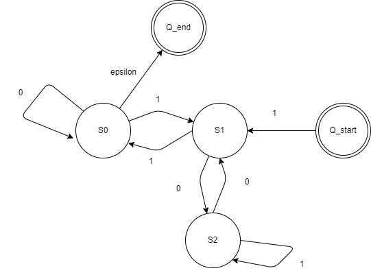

# 练习3.2.1：
**为下面的语言设计一个DFA或者NFA**

1）**能被5整除的二进制数**

设该DFA有5个状态，分别为$S_0$,$S_1$,$S_2$,$S_3$,$S_4$,分别表示除以5余数为0、1、2、3、4.
那么假设自二进制高位输入到DFA中，$S_0$为接受状态，DFA可以表示为：

  

2）**以a开头且以a结尾，中间由0个或多个a或b的实例构成的串**

利用NFA构造，设该NFA有三个状态$S_0$,$S_1$,$S_2$，其中$S_2$为接受状态，则NFA可以表示为：
 
 

 # 练习3.2.2：
**模拟下图所示NFA处理输入aabb的过程**
 
 

s算法为：
```
S = ε-closure(s0);
c = nextChar();
while(c!=EOF){
	S = ε-closure(move(S,c));
	c = nextChar();
}
if(S∩F!=⌀) return "yes";
else return "no";
```

对于该NFA，首先有

```
S = {0}
F = {3}
```

那么模拟过程为：
```
c = nextChar() = a
S = ε-closure(move(S,c)) = {0, 1}
c = nextChar() = a
S = ε-closure(move(S,c)) = {0, 1}
c = nextChar() = b
S = ε-closure(move(S,c)) = {0, 2}
c = nextChar() = b
S = ε-closure(move(S,c)) = {0, 2, 3}
S∩F!=⌀, return "yes"
```

 # 练习3.2.3：
**使用算法3.23和3.20将下述正则表达式转换为DFA，并尝试化简该DFA**

1) ((&epsilon;|a)b*)*

利用算法3.23构造出的NFA如图所示：

 

利用算法3.20将其转换为DFA：

| NFA状态| DFA状态   | a       | b|
| ------- | ------- | ------- |---|
| {0,1,2,4,5,6,7,9,10} | A | B | C|
| ε-closure({3})={1,2,3,4,5,6,7,9,10}	 |B| B | C |
| ε-closure({8})={1,2,4,5,6,7,8,9,10}    |C| B | C |

则其DFA为：
 


1) (a|b)* abb (a|b)*

构造出来的NFA如图所示：
 

 将其转换为DFA，状态转移表为：
 | NFA状态| DFA状态   | a       | b|
| ------- | ------- | ------- |---|
| {0,1,2,4,7} | A | B | C|
| ε-closure({3，8})={1,2,3,4,6,7,8}	 |B| B | D |
| ε-closure({5})={1,2,4,5,6,7}    |C| B | C |
| ε-closure({5,9})={1,2,4,5,6,7,9}    |D | B | E |
| ε-closure({5,10})={1,2,4,5,6,7,10,11,12,13,14,16,17}    |E| F | G |
| ε-closure({3,8,13})={1,2,3,4,6,7,8,10,11,12,13,14,16,17}    |F| F | H |
| ε-closure({5,15})={1,2,4,5,6,7,10,11,12,14,15,16,17}    |G| F | G |
| ε-closure({5,9,15})={1,2,4,5,6,7,9,11,12,14,15,16,17}    |H| F | I |
| ε-closure({5,9,10,15})={1,2,4,5,6,7,9,10,12,12,1,15,16,17}    |I| F | G |

对于转换出来的DFA：
 - 第一次划分将其划分为两个组{A,B,C,D},{E,F,G,H,I}
 - 第二次划分将其划分为{A,B,C},{D},{E,F,G,H,I}
 - 第三次划分为{A,C}{B}{D}{E,F,G,H,I}
 
 构造出来的DFA如图所示：
  

### 练习3.2.4*：
**所有能被3整除的正整数的二进制串能否被正则表达式表示？如果能，给出一个正则表达式；如果不能，讨论其原因。**

由第二次作业求得的结果可得：

给出符合题设的DFA，S0为初始状态，S1为模3余1的状态，S2为模3余2的状态。


注意到此时为正整数，即不包括0，所以开始状态需要至少为1，保证至少为11接受,则该NFA转换为RE的表达式即为：

    1[(10*1)|(01*0)]*10*