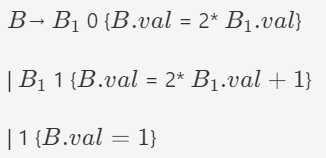
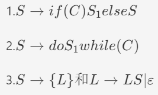

## 练习5.2.1：

**考虑文法**

    E → E + T | T
    T → T * F | F
    F → ( E ) | num | var**其中 num 表示数字字面量，如123；var 表示变量，如 x。如果一个项或表达式中不存在变量，它可以在编译期进行求值，例如 1+2*3。``设计一个 SDD 来判断各个项 T 和表达式 E 能否在编译期确定它的值。``（备注：可以用 E.isconst = true 表示它可以在编译期求值）**

设计的SDD如下表：

| 产生式     | 语义规则                             |
| ---------- | ------------------------------------ |
| E → E + T | E.isconst = E_1.isconst && T.isconst |
| E → T     | E.isconst = T.isconst                |
| T → T * F | T.isconst = T_1.isconst && F.isconst |
| T → F     | T.isconst = F.isconst                |
| F → ( E ) | F.isconst = E.isconst                |
| F → num   | F.isconst =True                      |
| F → var   | F.isconst = False                    |

## 练习5.2.2

**下面的SDT计算了一个正二进制数的值，改写这个SDT，消除左递归**

改写结果如下：

$ B → digit \{B.val=1\}R\{B.val =R.s\}$

$ R → digit \{R_1.val = 2*R_1.val + digit.val\}R_1 \{R.s = R_1.s\}$

$ R → ε\{R.s = R.i\}$

$ digit → 0 \{digit.val = 0\} | 1 \{digit.val = 1\} $

## 练习5.2.3

**为下面的产生式写出一个和例5.19类似的L 属性SDT。这里的每个产生式表示一个常见的C 语言中那样的控制流结构。你可能需要生成一个三地址语句来跳转到某个标号L，此时你可以生成语句goto L**

**注1：列表中的任何语句都可能包含一条从它的内部跳转到下一条语句的跳转指令，因此简单地为各个语句按顺序生成代码是不够的。注2：可以先写出SDD，然后按照5.4.5节方法转换为SDT。**

SDD:

    S -> if (C) S1 else S2 	L1 = new();
                                L2 = new();
                                C.true = L1;
                                C.false = L2;
                                S1.next = S.next;
                                S2.next = S.next;
                                S.code = C.code || label || L1 || S1.code || goto S.next || label || L2 || S2.code;

SDT:

    S -> if (				{L1 = new();
                            L2 = new();
                            C.true = L1;
                            C.false = L2;}
            C) 				{S1.next = S.next;}
            S1 else 		{S2.next = S.next;}
            S2 				{S.code = C.code || label || L1 || S1.code || goto S.next || label || L2 || S2.code;}

SDD:

    S -> do S1 while ( C ) 	L1 = new();
                            L2 = new();
                            C.true = L1;
                            C.false = S.next;
                            S1.next = L2;
                            S.code = label || L1 || S1.code || label || L2 || C.code;

SDT:

    S -> do 				{L1 = new();
                            L2 = new();
                            S1.next = L2;}
        S1 while ( 			{C.true = L1;
                            C.false = S.next;}
        C ) 				{S.code = label || L1 || S1.code || label || L2 || C.code;}

SDD:

    S → { L }				L.next = S.next;
                            S.code = L.code;

    L → L1 S 				T = new();
                            L1.next = T;
                            S.next = L.next;
                            L.code = L1.code || label || T || S.code;
    L → ε 					L.code = "";

SDT:

    S → { 					{L.next = S.next;}
        L }					{S.code = L.code;}

    L → 					{T = new();
                            L1.next = T;}
        L1 					{S.next = L.next;}
        S 					{L.code = L1.code || label || T || S.code; }

    L → ε 					{L.code = "";}
